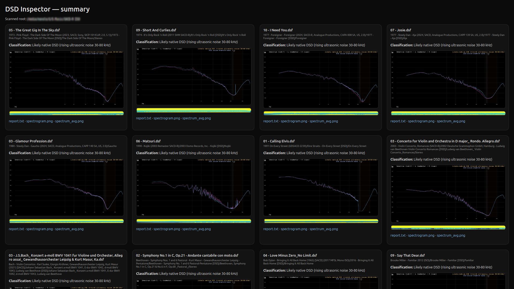

# dsd_inspector

A DSD (Direct Stream Digital) file inspector and a directory tree dsf scanner and analyzer

This repository contains:

- `dsd_inspector` — a command-line analyzer that generates spectrograms, spectrum overlays and a text report for a single dsd file.
- `dsd_tree_to_html.sh` — a Bash script that **recursively scans a music library**, runs `dsd_inspector` on **one file per folder** (by default the first `.dsf`), and writes **all outputs to a single central directory**. It also builds a **single HTML summary** with thumbnails and links.

<p align="center">
  
</p>

---

## Requirements

- Linux / macOS shell with: `bash`, `find`, `sort`, `grep`, `sed`, `head`, `realpath` (optional).
- `dsd_inspector` binary in your project (or built locally).
- Libraries used by `dsd_inspector` (when building yourself): FFmpeg (`libavformat`, `libavcodec`, `libavutil`, `libswresample`), FFTW3, zlib.

### Building `dsd_inspector` (if needed)

```bash
# Example Ubuntu/Debian deps
sudo apt-get update && sudo apt-get install -y   build-essential cmake pkg-config   libfftw3-dev zlib1g-dev   libavformat-dev libavcodec-dev libavutil-dev libswresample-dev

# Build
mkdir -p build && cd build
cmake ..
make -j
# Your binary should be at: ./dsd_inspector
```

---

## Script Usage

```bash
BIN=./dsd_inspector ./dsd_tree_to_html.sh "<ROOT>" [OUTROOT]
```

- **`<ROOT>`** – root directory to scan (recursively).
- **`[OUTROOT]`** – (optional) where all results will be stored. Default: `./dsd_inspector_out`.

### Examples

```bash
BIN=./dsd_inspector ./dsd_tree_to_html.sh "/media/dsf_files/"
```
```bash
BIN=build/./dsd_inspector ./dsd_tree_to_html.sh "/media/dsf_files/" "./dsd_inspecor_output"
```
```bash
BIN=folder_of_dsd_inspector/./dsd_inspector ./dsd_tree_to_html.sh "/media/dsf_files/"
```

Open the generated summary page:

```bash
./dsd_inspector_out/index.html
```

---

## What the script does

- Recursively finds folders containing at least one `.dsf` (or `.dff` if enabled).
- For **each such folder**, picks the **first file** and runs:
  ```bash
  dsd_inspector -i "<file>" --out "<OUTROOT>/<relative/path/>"
  ```
- Writes inside the central output root (mirrors the library’s relative structure).
- Appends an entry to `index.html` with:
  - **Classification** (from `report.txt`)
  - **Images**: `spectrum_overlay.png`, `spectrogram_pretty.png`
  - Links to `report.txt`, `spectrogram.png`, `spectrum_avg.png`

## Notes:
- Target sample-rate is 176400 Hz by default (good match for DSD64 multiples). Adjust with --sr.
- Heuristics are conservative; edge cases (heavy EQ, strong HF filters) may be "Inconclusive".

### Output layout

```
dsd_inspector_out/
  index.html
  <relative/path/to/album1>/
      report.txt
      spectrogram.png
      spectrogram_pretty.png
      spectrum_avg.png
      spectrum_overlay.png
  <relative/path/to/album2>/
      ...
```

---

## Options & Environment Variables

- **`BIN`** — path to your `dsd_inspector` binary  
  _Default_: `./dsd_inspector`

- **`FORCE=1`** — re-run analysis even if output images already exist (useful after code tweaks)
  ```bash
  FORCE=1 BIN=./dsd_inspector ./dsd_tree_to_html.sh "/media/.../dsf_files/"
  ```

- **`INCLUDE_DFF=1`** — also consider `.dff` files (still one file per folder)
  ```bash
  INCLUDE_DFF=1 BIN=./dsd_inspector ./dsd_tree_to_html.sh "/media/.../dsf_files/"
  ```

- **`[OUTROOT]` argument** — choose a different central output folder:
  ```bash
  BIN=./dsd_inspector ./dsd_tree_to_html.sh "/media/.../dsf_files/" "/tmp/my_dsd_out"
  ```

---

## Notes & Tips

- **Caching**: The script skips folders that already have `spectrum_overlay.png` in the corresponding output subfolder. Use `FORCE=1` to rebuild.
- **Performance**: On very large libraries, first run may take a while. The HTML is built incrementally and can be opened anytime.
- **One file per folder**: This keeps the summary concise and fast. If you want to test _all_ files later, it’s easy to adapt the loop.
- **Safety**: Your music tree is read-only; all generated files live under `OUTROOT`.

---

## Troubleshooting

- **`dsd_inspector: not found`**  
  Set the correct path via `BIN=...`, or build the binary (see above).

- **HTML shows broken images**  
  Make sure you open `index.html` from the **same machine** that generated it (paths are relative within `OUTROOT`).

- **Re-scan everything**  
  Run with `FORCE=1` to ignore cached images:
  ```bash
  FORCE=1 BIN=./dsd_inspector ./dsd_tree_to_html.sh "<ROOT>"
  ```

---

## License

MIT License
